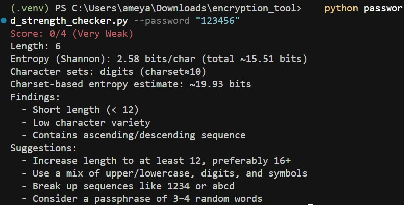
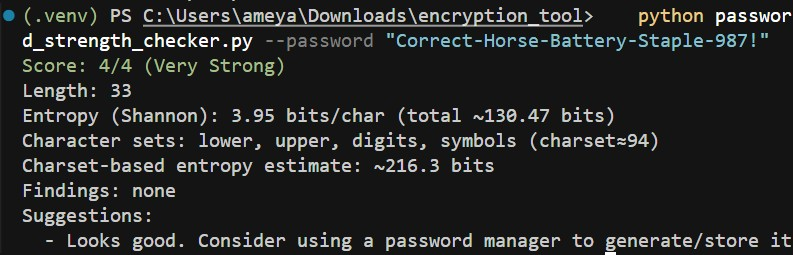
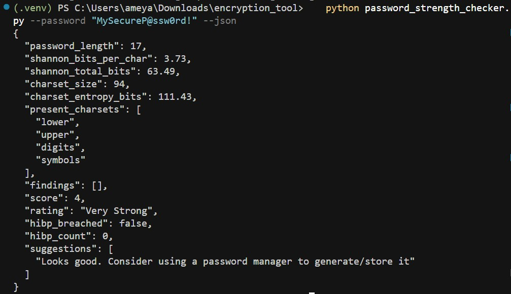

## Password Strength Checker (CLI)

Evaluate password strength locally with entropy, pattern analysis, and optional Have I Been Pwned (HIBP) breach checks.

### Features
- Entropy estimation (Shannon and character-set based)
- Pattern analysis: length, character variety, repeats, sequences (e.g., abcd/1234), keyboard sequences (qwerty/asdf), years, and common words
- Optional HIBP k-anonymity check (no password sent; only first 5 chars of SHA-1 hash prefix)
- Suggestions to improve strength
- Human-readable or JSON output
- Works offline by default (no third-party dependencies)

### Quick start

Requirements: Python 3.9+

```bash
# Run interactively (recommended)
python password_strength_checker.py

# Or pass a password via flag (be mindful of shell history)
python password_strength_checker.py --password "YourP@ssw0rd!" --hibp

# Or via stdin
echo "YourP@ssw0rd!" | python password_strength_checker.py --stdin

# JSON output (machine-readable)
python password_strength_checker.py --password "YourP@ssw0rd!" --json
```

### Usage

```bash
python password_strength_checker.py [options]

Options:
  --password TEXT        Password value (avoid using in shell history; prefer prompt)
  --stdin                Read password from STDIN
  --hibp                 Check against Have I Been Pwned (k-anonymity API)
  --min-length N         Minimum recommended length (default: 12)
  --json                 Output JSON
  --no-color             Disable ANSI colors
  -h, --help             Show help
```

### Security and privacy
- Default operation is fully offline. No network calls unless `--hibp` is set.
- HIBP check sends only the first 5 characters of the SHA-1 hash of your password to the API, per their k-anonymity model.
- Avoid `--password` on shared systems; interactive prompt or `--stdin` is safer.

### Example output

```
Score: 3/4 (Strong)
Length: 14
Entropy (Shannon): 3.11 bits/char (total ~43.5 bits)
Charset entropy estimate: ~92.1 bits (charset≈94)
Findings:
  - Contains common year-like pattern: 2023
  - Includes a simple ascending sequence: 123
HIBP breaches: Not found
Suggestions:
  - Avoid predictable years/dates (e.g., 199x/20xx)
  - Break up sequences like 123, abc
  - Add more random words or increase length to 16+
```


## Screenshots

### Weak Password Analysis


### Strong Password Analysis  


### JSON Output



### License
MIT

### Disclaimer
For educational purposes only. Do not test passwords you use for critical accounts on shared machines. Always follow your organization's security policies.


